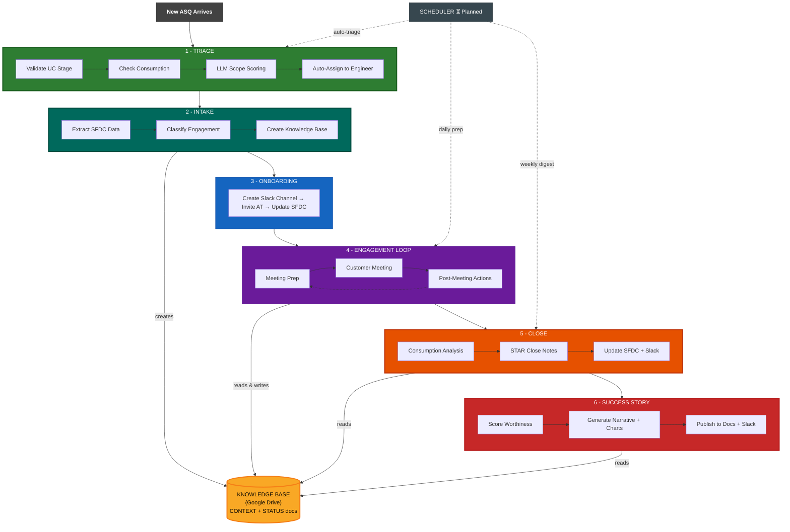

# EMEA STS Productivity Hackathon — Pillar 3

Clone of [fe-sts](https://github.com/databricks-field-eng/vibe/tree/main/plugins/fe-sts) from the Vibe plugin marketplace, plus [sts-success-stories](https://github.com/databricks-eng/plugin-marketplace/tree/main/experimental/teams/fe-sts/sts-success-stories) from the experimental plugin marketplace.

**Goal:** Extend the fe-sts plugin to cover the complete STS engagement lifecycle — from triage to success story — with AI-driven automation at every step.

**Team:** 5 people | **Duration:** 1 day | **Platform:** [go/vibe](https://github.com/databricks-field-eng/vibe) Claude Code plugins

---

## ASQ Lifecycle — AI Automation Map



### Key Innovation: Shared Knowledge Base

The `asq-intake` skill creates a **per-ASQ Google Drive workspace** that serves as a shared knowledge base for all downstream skills. Each skill in the lifecycle reads from and writes back to this workspace, building a cumulative context that gets richer over time:

| Lifecycle Phase | Reads from KB | Writes to KB |
|----------------|---------------|--------------|
| **Intake** | — | Creates CONTEXT doc (ASQ details, CAST, classification) + STATUS doc + folder structure |
| **Meeting Prep** | CONTEXT doc for engagement background, past session notes | — (read-only) |
| **Post-Meeting** | CONTEXT for context, STATUS for current phase | Session notes to sessions/, updated STATUS |
| **Close** | Full engagement history from CONTEXT + sessions/ | Final close notes, outcome summary |
| **Success Story** | CONTEXT + consumption data + session history | Published story draft to research/ |

This means every skill has full context without re-querying SFDC or Slack — and the knowledge base grows with every interaction. Google Drive IDs are stored in the CONTEXT doc so any agent can locate resources programmatically.

---

## Hackathon Deliverables

| Phase | Deliverable | Owner | Skill | Status | Description |
|-------|-------------|-------|-------|--------|-------------|
| 1 | **ASQ Auto-Triage** | Shidong Zhang | `asq-triage` | **Done** | Automates the full triage decision tree: UC stage validation, consumption checks, LLM scope scoring, competency-matrix assignment. Reduces 10-15 min/ASQ to seconds. |
| 2 | **ASQ Intake** | Aleksandra Stanojevic | `asq-intake` | **Done** | Extracts ASQ data from Salesforce, classifies the engagement, and creates a shared Knowledge Base (Google Drive workspace with CONTEXT and STATUS docs). |
| 4a | **Enhanced Meeting Prep** | Nadja Bulajic | `asq-refresher` | **Done** | Rewrites the refresher from a 4-step sequential flow to a 5-step parallel enrichment workflow with DBRA deep research, Logfood consumption metrics, Genie trends, and LLM synthesis into executive-ready briefs. ([PR #1](https://github.com/shdzhang/emea-sts-productivity-hackathon/pull/1)) |
| 4b | **Post-Meeting Follow-up** | Gergelj Kis | `asq-followup` | **Done** | Replaces `asq-update` with 8-phase workflow: Gemini meeting notes ingestion, LLM action extraction, customer follow-up email drafts, CAST-formatted SFDC notes, calendar scheduling, Slack summaries, and service goals alignment assessment with 14 STS service definitions. ([PR #2](https://github.com/shdzhang/emea-sts-productivity-hackathon/pull/2)) |
| 6 | **Success Story Generator** | Nada El Atlassi | `success-story-generator` | **Done** | Adapted from [sts-success-stories](https://github.com/databricks-eng/plugin-marketplace/tree/main/experimental/teams/fe-sts/sts-success-stories) with interactive menu, Gmail enrichment, `--period` time filtering, and Slack DM delivery. |
| — | **ASQ Scheduler** | TBD | `asq-scheduler` | Planned | Scheduling infrastructure to automate skill invocation on a cadence (triage every 2h, daily meeting prep, weekly digest). |

> **Phase numbers match the diagram above.** Phases 3 (Onboarding) and 5 (Close) already existed in fe-sts v2.0.2. Phases 1, 2, 4a, 4b, and 6 have been implemented in this hackathon.

### What Already Existed (fe-sts v2.0.2)

| Skill | Purpose |
|-------|---------|
| `asq-onboarding` | Discover new ASQs, create Slack channels, invite AT, update SFDC |
| `asq-update` | Draft SFDC notes + CAST + Slack messages after meetings |
| `asq-refresher` | Meeting brief from SFDC, Slack, Calendar, Gmail, Obsidian |
| `asq-close` | Close ASQs with consumption analysis and STAR-format notes |
| `asq-local-cache` | Local YAML cache + user config + preferences management |

### What This Hackathon Adds

| Phase | Skill | What's New |
|-------|-------|-----------|
| 1 | `asq-triage` | **Brand new** — full triage automation with 8-phase workflow, 5 reference docs, LLM scope scoring, competency-matrix assignment |
| 2 | `asq-intake` | **Brand new** — SFDC extraction, engagement classification, Google Drive workspace creation with CONTEXT + STATUS docs |
| 4a | `asq-refresher` | **Rewritten** — parallel DBRA + Logfood + Genie enrichment, LLM synthesis, brief template, graceful degradation ([PR #1](https://github.com/shdzhang/emea-sts-productivity-hackathon/pull/1)) |
| 4b | `asq-followup` | **Replaces `asq-update`** — Gemini notes ingestion, LLM action extraction, follow-up emails, CAST SFDC notes, calendar scheduling, Slack summaries, service goals alignment with 14 service definitions ([PR #2](https://github.com/shdzhang/emea-sts-productivity-hackathon/pull/2)) |
| 6 | `success-story-generator` | **Adapted** from [sts-success-stories](https://github.com/databricks-eng/plugin-marketplace/tree/main/experimental/teams/fe-sts/sts-success-stories) with interactive menu, Gmail enrichment, time period filtering, Slack DM delivery |
| — | `asq-scheduler` | Planned — scheduling infrastructure for automated skill invocation |

---

## Improvements Over Original Code

Detailed comparison of hackathon deliverables against the [upstream fe-sts v2.0.2](https://github.com/databricks-field-eng/vibe/tree/main/plugins/fe-sts).

### Phase 1 — ASQ Auto-Triage: `asq-triage` (Shidong Zhang) ✅

**Before:** No triage skill existed. Triage was entirely manual — the manager opened each new ASQ, checked UC stages in SFDC, verified consumption in Logfood, judged scope from the description, looked up the competency matrix spreadsheet, checked team workload, and posted Chatter comments one by one.

**After:** Brand-new 210-line SKILL.md with 8 automated phases and 5 reference docs:

| Capability | Before (manual) | After (asq-triage) |
|-----------|-----------------|---------------------|
| UC stage validation | Open each ASQ, navigate to UCO junction object, check stage manually | Batch SOQL query on `Approved_UseCase__c`, auto-apply U3+/U4+ rules |
| Consumption check | Log into Logfood/Genie, look up account, compare against threshold | Automated query with $1K threshold, LA-to-Core conversion detection |
| Scope scoring | Read description, make subjective judgment | LLM scores 1-10 using rubric in `triage-rules.md`, checks against cached service scope |
| Team assignment | Open competency matrix spreadsheet, check each person's workload in SFDC | 3-factor formula (skills 50% + workload 30% + experience 20%) from `competency-matrix.md` |
| Chatter comments | Copy/paste templates, manually tag users with SFDC IDs | 7 templates in `comment-templates.md`, auto-populated with ASQ-specific data |
| Under Review follow-up | Remember to go back and check stale ASQs | Phase 1b: batch query + 5-step re-triage process |
| Batch processing | One ASQ at a time | All new ASQs triaged together, grouped by action type for review |

**New files:** `SKILL.md`, `references/triage-rules.md`, `references/competency-matrix.md`, `references/comment-templates.md`, `references/sfdc-schema.md`, `references/cache-setup.md` (6 files, ~750 lines total)

---

### Phase 2 — ASQ Intake: `asq-intake` (Aleksandra Stanojevic) ✅

**Before:** No intake skill existed. Engineers manually looked up ASQ details in Salesforce, created Google Drive folders by hand, and wrote CONTEXT/STATUS docs from scratch. Each skill operated in isolation with no shared state.

**After:** Brand-new 358-line SKILL.md with 6-phase workflow (plus Phase 1b) that introduces the **shared knowledge base** pattern — the most innovative part of the hackathon. Updated with production-ready SOQL queries, Google Docs MCP patterns, and SFDC relationship fixes:

| Capability | Before (manual) | After (asq-intake) |
|-----------|-----------------|---------------------|
| ASQ lookup | Navigate SFDC, find the ASQ record | Direct lookup by AR number or customer name search with multi-match selection. Includes exact SOQL queries against `ApprovalRequest__c` with 14 fields |
| Account team | Manually find AE and SA from the account page | **Separate Phase 1b** fetches account owner via `Account WHERE Id = ...` — avoids invalid `Last_SA_Engaged__r` relationship on `ApprovalRequest__c` |
| Account data | Manually pull consumption, workspaces, contract info from account page | Automated extraction of DBU consumption (30d/60d), workspace list, consumption mode breakdown |
| Engagement classification | Subjective assessment | LLM classifies pillar, service type, engagement format, and estimated complexity |
| CAST framework | Write from scratch in a doc | Auto-populated from ASQ description with explicit "to be refined" markers for incomplete elements |
| Google Drive workspace | Manually create folder, subfolders, docs | Auto-creates `AR-XXXXX_CustomerName/` with research/, sessions/, code/, comms/ subfolders using Google Drive MCP |
| CONTEXT + STATUS docs | Write from scratch | Write markdown to temp file, create Google Doc via `mcp__google__docs_document_create_from_markdown`, then move into engagement folder. Two-pass creation: docs created first, then CONTEXT updated with actual doc IDs |
| **Shared knowledge base** | **None — each skill queried SFDC independently** | **Google Drive IDs recorded in CONTEXT doc; all downstream skills read/write to this workspace, building cumulative context across the entire engagement lifecycle** |

**Why this matters:** In the original fe-sts, every skill starts from scratch — querying SFDC, searching Slack, re-gathering the same context. With `asq-intake`, the CONTEXT doc becomes the single source of truth. Meeting prep reads it, post-meeting actions update it, close reads the full history. The knowledge base grows with every interaction, eliminating redundant queries and ensuring no context is lost between sessions.

**New files:** `SKILL.md` (358 lines)

---

### Phase 4a — Enhanced Meeting Prep: `asq-refresher` (Nadja Bulajic) ✅

**Before (73 lines):** 4-step sequential workflow — gather from SFDC/Calendar/Gmail/Obsidian, fetch Slack history, fetch STS content, format a basic brief with raw field dumps.

**After (199 lines + 121-line template):** 5-step parallel enrichment workflow with LLM synthesis.

| Capability | Before (v2.0.2) | After (hackathon) |
|-----------|-----------------|-------------------|
| Data sources | 5 (SFDC, Calendar, Gmail, Slack, Obsidian) | 9 (+ DBRA, Logfood, Genie, Glean) |
| Enrichment model | Sequential — each step waits for the previous | Parallel — all 5 enrichment calls issued simultaneously |
| Consumption data | None | Logfood 30-day spend by product + 30d vs prior 30d growth trend (gated to LA/GA ASQs only) |
| Internal research | None | DBRA deep search: escalations, engineering blockers, internal discussions |
| Genie metrics | None | Account consumption summary from STS Genie Space |
| Output format | Raw field listing (ASQ Context, Action Items table) | LLM-synthesized executive brief with structured template |
| Brief template | None — hardcoded format in SKILL.md | Dedicated `references/brief-template.md` with 7 sections |
| New sections | — | Executive Summary, Meeting Timeline, Meeting Recap, Consumption Summary, Internal Context, Key Contacts |
| Source attribution | None | Every fact tagged with `[SFDC]`, `[Slack]`, `[Logfood]`, `[DBRA]`, etc. |
| Graceful degradation | "present what you have if a source errored" (1 line) | Each source fails independently with specific fallback messages |
| Output routing | Terminal only | Terminal (default) + Google Doc + Slack (on request) |
| Contradiction detection | None | Flags when sources disagree |

**Changed files:** `SKILL.md` (73 → 199 lines), new `references/brief-template.md` (121 lines)

---

### Phase 4b — Post-Meeting Follow-up: `asq-followup` (Gergelj Kis) ✅

**Before (118 lines, 2 files):** `asq-update` had a 7-phase workflow — gather context via `asq_tools.py`, draft SFDC status note with user preferences, check if CAST needed, draft Slack message, present for approval, apply updates, optional Obsidian sync. No email drafting, no meeting notes parsing, no calendar scheduling, no service alignment.

**After (636 lines + 20 supporting files, ~2,900 lines total):** Completely replaced with `asq-followup` — an 8-phase workflow that starts from Gemini meeting notes and produces all post-meeting artifacts. ([PR #2](https://github.com/shdzhang/emea-sts-productivity-hackathon/pull/2))

| Capability | Before (`asq-update` v2.0.2) | After (`asq-followup`) |
|-----------|-------------------------------|------------------------|
| Meeting notes input | User provides raw notes manually | **Gemini notes auto-retrieval** from Gmail or Meet recording URL, with multi-match selection and manual fallback (`references/gemini-notes-parser.md`) |
| Action extraction | None — user writes action items | **LLM extraction** of action items (owner + task + due date), key decisions, open questions, blockers, UCO progression indicators (`references/meeting-parser.md`) |
| Follow-up email | None | **Gmail draft** with professional template: thank-you, key decisions summary, action items table, next steps, proposed meeting slots (`resources/email-templates.md`) |
| SFDC notes | Draft status note with user format preferences | **CAST-formatted YAML** status note with meeting type, attendees, outcomes, sentiment, UCO stage, and follow-up date (`references/cast-integration.md`) |
| Calendar scheduling | None | **Smart scheduling**: extracts follow-up date from notes if mentioned, otherwise runs availability scan and proposes 3 time slots |
| Slack summary | Draft message matching channel tone | **Structured Slack summary** with key decisions, action items, and next meeting info — only posts if channel is configured |
| Service alignment | None | **Phase 8: Service Goals Alignment Assessment** — loads the STS service definition for the ASQ's support type, compares meeting activities against key activities and deliverables, calculates alignment score, and generates targeted recommendations for next meeting |
| STS service catalog | None | **14 service definition files** across 4 pillars (Platform, Data Engineering, Data Warehousing, Migration, ML & GenAI) with key activities, deliverables, and success metrics (`references/sts-services/`) plus `resources/service_alignment.py` |
| Invocation modes | Single entry: customer name/alias | **5 modes**: URL, ASQ ID, customer name, date search, manual input |

**New files:** `SKILL.md` (636 lines), `references/cast-integration.md` (243 lines), `references/gemini-notes-parser.md` (492 lines), `references/meeting-parser.md` (395 lines), `references/sts-services/` (14 service READMEs + index, ~700 lines), `resources/email-templates.md` (226 lines), `resources/service_alignment.py` (215 lines) — 21 files, ~2,900 lines total

---

### Phase 6 — Success Story Generator: `success-story-generator` (Nada El Atlassi) ✅

**Before (245 lines):** The [sts-success-stories](https://github.com/databricks-eng/plugin-marketplace/tree/main/experimental/teams/fe-sts/sts-success-stories) plugin existed in the experimental marketplace with a 5-step workflow: resolve input, gather data in parallel, score & rank, generate output, and check existing stories. It supported Glean + Slack enrichment.

**After (349 lines):** Adapted with 104 new lines adding an interactive menu, new data sources, time period filtering, and Slack DM delivery. Reference files (`SCORING.md`, `METRIC_MAPPINGS.md`, `CHART_SPEC.md`) and `generate_chart.py` are unchanged.

| Capability | Original (marketplace) | Adapted (hackathon) |
|-----------|----------------------|---------------------|
| Invocation | Parse `--account`/`--asq`/`--engineer`/`--top` flags, run full pipeline | **New interactive menu** with 8 actions: generate Doc, Slides, draft Slack post, send Slack DM, get customer feedback, get win announcements, score & rank, or all |
| Time filtering | None — queries all completed ASQs | **New `--period` flag** (default: 3m) — filter by `1m`–`12m`, `1y`–`5y`, or `all` with `DATE_ADD` WHERE clause |
| Enrichment sources | Glean + Slack (generic win search) | **+ Gmail** for customer thank-you emails and internal feedback; **Slack upgraded** to two targeted searches: (1) win announcements mentioning the engineer by Slack user ID, (2) commit/deal announcements for the account |
| Slack delivery | None | **New Step 6: Slack DM Win Summary** — formatted win message with growth %, blurb, and Google Doc link sent to engineer's DMs (opt-in with draft preview) |
| Draft Slack post | None | **Menu option 3** — generates a formatted win announcement for a channel, shows draft before posting |
| Customer feedback | None | **Menu option 5** — searches Gmail (`from:*@customer.com`, `subject:thank`) and Slack for direct customer appreciation quotes |
| Win announcements | None | **Menu option 6** — finds Slack posts where AEs/SAs celebrated deals with STS contribution |

**Files changed:** `SKILL.md` (245 → 349 lines, +104 lines). References and scripts unchanged.

---

### Cross-cutting: ASQ Scheduler — `asq-scheduler` (TBD) ⏳

**Before:** No scheduling existed. Every skill had to be manually invoked by the user.

**Planned:** launchd-based scheduling infrastructure to automate skill invocation on a cadence (triage every 2h during business hours, daily meeting prep at 8 AM, weekly portfolio digest on Mondays).

---

## How AI Improves Productivity

Each skill replaces manual, repetitive work with AI-driven automation:

| Manual Process | AI Automation | Time Saved |
|---------------|---------------|------------|
| Read ASQ description, check UC stage in SFDC, verify consumption, decide scope, find available team member, post Chatter comment | `asq-triage` runs all checks in parallel, scores with LLM, proposes assignment — human just approves | **10-15 min/ASQ** |
| Open 5 tabs (SFDC, Slack, Calendar, Gmail, Obsidian), read through history, write notes | `asq-refresher` aggregates all sources in one call, synthesizes an executive brief | **15-20 min/meeting** |
| Type meeting notes, copy to SFDC, rewrite for Slack, draft follow-up email, schedule next meeting | `asq-followup` ingests Gemini notes, extracts actions via LLM, drafts email + SFDC CAST + Slack + calendar event — human just reviews and approves | **15-20 min/meeting** |
| Query consumption data, compare before/after, write STAR notes, decide if story-worthy | `asq-close` + success story auto-analyzes impact, generates narrative with charts | **30-45 min/close** |
| Look up ASQ in SFDC, create Drive folders, write CONTEXT/STATUS docs from scratch | `asq-intake` extracts SFDC data, classifies engagement, creates full workspace in one command | **20-30 min/ASQ** |
| Manually invoke each skill, remember the cadence | `asq-scheduler` automates skill invocation on a schedule (triage, prep, digest) | **30 min/week** |

**Total estimated savings:** ~2-3 hours/week per STS engineer across the EMEA team.

---

## Architecture

All skills follow the same pattern:
- **SKILL.md** — Prompt-driven workflow (no traditional code)
- **references/** — Decision rules, templates, schemas
- **resources/** — Python CLI tools (`asq_tools.py`, `asq_cache.py`, `asq_config.py`)

Skills compose existing Vibe infrastructure: Salesforce CLI, Slack MCP, Google Workspace APIs, Databricks Genie Spaces, Logfood, Glean, and DBRA.

```
fe-sts/
├── .claude-plugin/plugin.json
├── commands/
│   ├── sts-help.md
│   └── sts-config.md
└── skills/
    ├── asq-triage/          ← NEW (Phase 1)
    │   ├── SKILL.md
    │   └── references/
    │       ├── triage-rules.md
    │       ├── competency-matrix.md
    │       ├── comment-templates.md
    │       ├── sfdc-schema.md
    │       └── cache-setup.md
    ├── asq-intake/          ← NEW (Phase 2)
    ├── asq-onboarding/      (existing, Phase 3)
    ├── asq-refresher/       ← ENHANCED (Phase 4a)
    ├── asq-followup/        ← NEW, replaces asq-update (Phase 4b)
    │   ├── SKILL.md
    │   ├── references/
    │   │   ├── cast-integration.md
    │   │   ├── gemini-notes-parser.md
    │   │   ├── meeting-parser.md
    │   │   └── sts-services/    (14 service definitions)
    │   └── resources/
    │       ├── email-templates.md
    │       └── service_alignment.py
    ├── asq-close/           (existing, Phase 5)
    ├── success-story-generator/ ← ADAPTED (Phase 6)
    ├── asq-local-cache/     (existing)
    └── asq-scheduler/       ← NEW (planned)
```

---

## Source

- fe-sts plugin: [databricks-field-eng/vibe/plugins/fe-sts](https://github.com/databricks-field-eng/vibe/tree/main/plugins/fe-sts)
- success-story-generator: [databricks-eng/plugin-marketplace/.../sts-success-stories](https://github.com/databricks-eng/plugin-marketplace/tree/main/experimental/teams/fe-sts/sts-success-stories)
- Hackathon planning doc: [STS EMEA - April FY26 Hackathon Pillar 3](https://docs.google.com/document/d/1hJRumsQso60yzBb39zToUTB6x4on8iS_4aLkPimgWrc/edit?tab=t.0)
