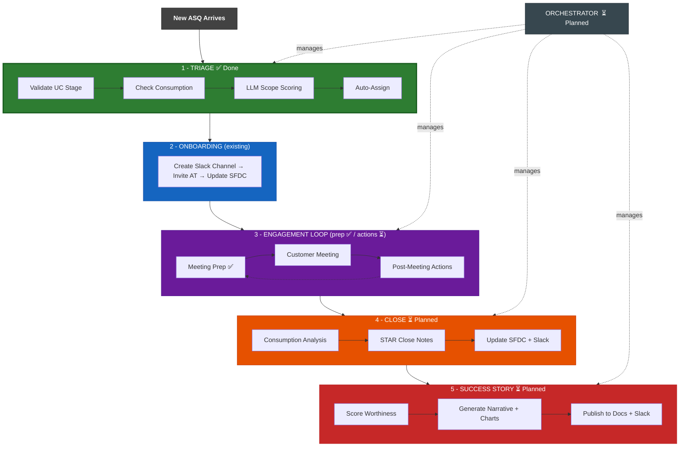

# EMEA STS Productivity Hackathon — Pillar 3

Clone of [fe-sts](https://github.com/databricks-field-eng/vibe/tree/main/plugins/fe-sts) from the Vibe plugin marketplace.

**Goal:** Extend the fe-sts plugin to cover the complete STS engagement lifecycle — from triage to success story — with AI-driven automation at every step.

**Team:** 5 people | **Duration:** 1 day | **Platform:** [go/vibe](https://github.com/databricks-field-eng/vibe) Claude Code plugins

---

## ASQ Lifecycle — AI Automation Map



---

## Hackathon Deliverables

| # | Idea | Owner | Skill | Status | Description |
|---|------|-------|-------|--------|-------------|
| 1 | **ASQ Auto-Triage** | Shidong Zhang | `asq-triage` | **Done** | Automates the full triage decision tree: UC stage validation, consumption checks, LLM scope scoring, competency-matrix assignment. Reduces 10-15 min/ASQ to seconds. |
| 2 | **Enhanced Meeting Prep** | Nadja Bulajic | `asq-refresher` | **Done** | Rewrites the refresher from a 4-step sequential flow to a 5-step parallel enrichment workflow with DBRA deep research, Logfood consumption metrics, Genie trends, and LLM synthesis into executive-ready briefs. ([PR #1](https://github.com/shdzhang/emea-sts-productivity-hackathon/pull/1)) |
| 3 | **Post-Meeting Actions** | TBD | `asq-update` | Planned | Extend with customer follow-up emails, structured action-item extraction, next-meeting scheduling, and UCO stage updates. |
| 4 | **Success Story Generator** | TBD | `asq-close` | Planned | Hook into close flow: score story-worthiness (4-criterion rubric), auto-generate narrative with consumption charts, publish to Google Docs. |
| 5 | **ASQ Orchestrator** | TBD | `asq-orchestrator` | Planned | Central orchestrator that manages and coordinates all ASQ lifecycle skills end-to-end. |

> **Note:** `asq-triage` (Idea 1) and `asq-refresher` (Idea 2) have been implemented. The other skills currently contain their original fe-sts v2.0.2 code and will be updated in-place once hackathon implementations are ready.

### What Already Existed (fe-sts v2.0.2)

| Skill | Purpose |
|-------|---------|
| `asq-onboarding` | Discover new ASQs, create Slack channels, invite AT, update SFDC |
| `asq-update` | Draft SFDC notes + CAST + Slack messages after meetings |
| `asq-refresher` | Meeting brief from SFDC, Slack, Calendar, Gmail, Obsidian |
| `asq-close` | Close ASQs with consumption analysis and STAR-format notes |
| `asq-local-cache` | Local YAML cache + user config + preferences management |

### What This Hackathon Adds

| Skill | What's New |
|-------|-----------|
| `asq-triage` | **Brand new** — full triage automation with 8-phase workflow, 5 reference docs, LLM scope scoring, competency-matrix assignment |
| `asq-refresher` | **Done** — rewritten with parallel DBRA + Logfood + Genie enrichment, LLM synthesis, brief template, graceful degradation ([PR #1](https://github.com/shdzhang/emea-sts-productivity-hackathon/pull/1)) |
| `asq-update` | Extended with follow-up emails, action-item extraction, meeting scheduling |
| `asq-close` | Integrated success-story scoring and generation |
| `asq-orchestrator` | **Brand new** — central orchestrator that coordinates all ASQ lifecycle skills |

---

## How AI Improves Productivity

Each skill replaces manual, repetitive work with AI-driven automation:

| Manual Process | AI Automation | Time Saved |
|---------------|---------------|------------|
| Read ASQ description, check UC stage in SFDC, verify consumption, decide scope, find available team member, post Chatter comment | `asq-triage` runs all checks in parallel, scores with LLM, proposes assignment — human just approves | **10-15 min/ASQ** |
| Open 5 tabs (SFDC, Slack, Calendar, Gmail, Obsidian), read through history, write notes | `asq-refresher` aggregates all sources in one call, synthesizes an executive brief | **15-20 min/meeting** |
| Type meeting notes, copy to SFDC, rewrite for Slack, draft follow-up email, schedule next meeting | `asq-update` generates all artifacts from raw notes — SFDC, Slack, email, calendar | **10-15 min/meeting** |
| Query consumption data, compare before/after, write STAR notes, decide if story-worthy | `asq-close` + success story auto-analyzes impact, generates narrative with charts | **30-45 min/close** |
| Manually invoke each skill separately, track which ASQs need which action | `asq-orchestrator` coordinates the full lifecycle — routes ASQs to the right skill automatically | **30 min/week** |

**Total estimated savings:** ~2-3 hours/week per STS engineer across the EMEA team.

---

## Architecture

All skills follow the same pattern:
- **SKILL.md** — Prompt-driven workflow (no traditional code)
- **references/** — Decision rules, templates, schemas
- **resources/** — Python CLI tools (`asq_tools.py`, `asq_cache.py`, `asq_config.py`)

Skills compose existing Vibe infrastructure: Salesforce CLI, Slack MCP, Google Workspace APIs, Databricks Genie Spaces, Logfood, Glean, and DBRA.

```
fe-sts/
├── .claude-plugin/plugin.json
├── commands/
│   ├── sts-help.md
│   └── sts-config.md
└── skills/
    ├── asq-triage/          ← NEW (Hackathon Idea 1)
    │   ├── SKILL.md
    │   └── references/
    │       ├── triage-rules.md
    │       ├── competency-matrix.md
    │       ├── comment-templates.md
    │       ├── sfdc-schema.md
    │       └── cache-setup.md
    ├── asq-onboarding/      (existing)
    ├── asq-refresher/       ← ENHANCE (Idea 2)
    ├── asq-update/          ← ENHANCE (Idea 3)
    ├── asq-close/           ← ENHANCE (Idea 4)
    ├── asq-local-cache/     (existing)
    └── asq-orchestrator/    ← NEW (Idea 5, planned)
```

---

## Source

Cloned from [databricks-field-eng/vibe/plugins/fe-sts](https://github.com/databricks-field-eng/vibe/tree/main/plugins/fe-sts).

Hackathon planning doc: [STS EMEA - April FY26 Hackathon Pillar 3](https://docs.google.com/document/d/1hJRumsQso60yzBb39zToUTB6x4on8iS_4aLkPimgWrc/edit?tab=t.0).
